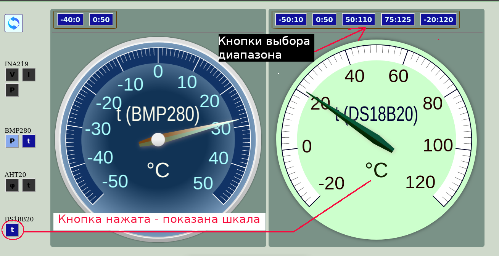

### Просмотр показаний датчиков в браузере
В проэкте к ESP8266 или NodeMCU присоединяются модули - INA219, AHT20, BMP280, DS18B20.
Сам ESP8266 работает как точка доступа и html сервер. При запросе от клиента опрашиваются 
датчики. Значения показаний датчиков отправляются клиенту, где они показываются на шкалах 
приборов.
Вот как это выглядит в браузере.

Если кто заинтересуется подробностями - они файле  <a href="https://github.com/sensorsViewers/digitalSensors/data/src/help.html">Help.html</a>
Картинки с изображениями находятся в папке <a href="digitalSensors/data/src/img">Images</a>
### Для показа значений в виде приборов используется javaScript библиотека [gauge.js](https://canvas-gauges.com)
К сожалению этот <i>маркдаун</i> я не знаю и как запихнуть html страницу в  readme.md тоже, а заново переписывать справку в другом формате как-то неправильно.
