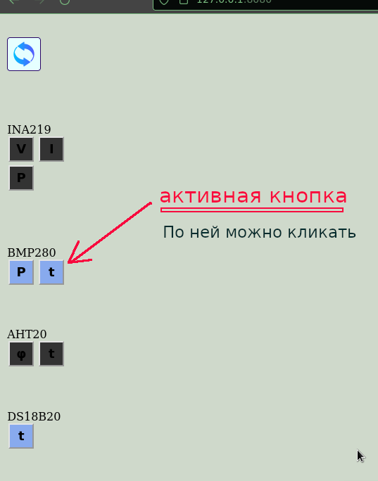
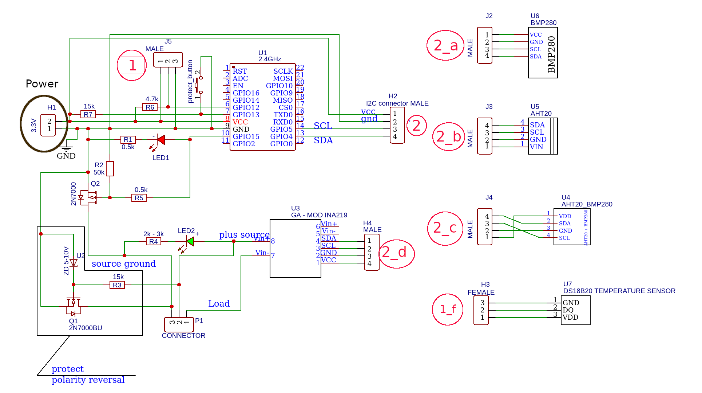

### Просмотр показаний датчиков в браузере
В проэкте к ESP8266 или NodeMCU присоединяются модули - INA219, AHT20, BMP280, DS18B20.
Сам ESP8266 работает как точка доступа и html сервер. При запросе от клиента опрашиваются 
датчики. Значения показаний датчиков отправляются клиенту, где они показываются на шкалах 
приборов.
Вот как это выглядит в браузере.

Если кто заинтересуется подробностями - они файле  <a href="https://github.com/sensorsViewers/digitalSensors/data/src/help.html">Help.html</a>
Картинки с изображениями находятся в папке <a href="digitalSensors/data/src/img">Images</a>
### Для показа значений в виде приборов используется javaScript библиотека [gauge.js](https://canvas-gauges.com)
 Справка по модулю img{ max-width : 100%; border : solid blue 2px; }

*   [Справка по работе с устройством](#man)
*   [Настройки модуля](#props)
*   [Создание и загрузка прошивки](#compile)

Краткая справка по работе с устройством
---------------------------------------

Устройство предназначено для показа значений датчиков в браузере. Далее в тексте везде, где написано про ESP8266 так-же справедливо и для NodeMCU.

Как это работает:  
Кратко  
  Значения с присоединённых к ESP8266 датчиков считываются и через WI-FI сеть передаются на компьютер(телефон). Браузер устройства отображает полученные значения.  
  
Более подробно

*   При успешном старте ESP8266 будет создана точка доступа. Для просмотра показаний подключаемся к ней.  
    _По умолчанию называется - ESP8266, пароль - my.esp8266_. Адрес в браузере 192.168.4.2  
    **Важно !** Так-как соединение идёт по протоколу http(не защищённое) браузер( Chrom точно, остальные надо проверять ) может и отклонить соединение. В этом случае нужно в настройках браузера разрешить незащищённые соединения, и перезагрузить страницу.
*   К модулю ESP8266 присоединяются датчики. Датчики присоединяются через разъёмы.  
      1) INA219 , BMP280, AHT20 (можно взять и совмещённые BMP280 c AHT20) - через один. Протокол I2C.  
      2) DS18B20 - через другой. Протокол one\_wire.  
    _Присоединять можно как до включения, так и в процессе работы._
*   Обновить список присоединённых устройств, нажав на кнопку . Обновлять необходимо при манипуляциях с датчиками или по желанию. При данном действии ESP8266 проверит наличие подключенных датчиков и станет отправлять данные с них.
*   Кнопки присоединённых датчиков изменят цвет.  
    По щелчку по таким кнопкам появляются приборные шкалы, на которых отображаются полученные значения. В верху страницы можно отобразить только одну или две шкалы. При количестве более двух надо прокрутить страницу вниз.  
    При повторном щелчке по кнопке данная шкала перестанет отображаться.
*   При щелчке по панели показания отобразятся на числовой панели. Для обратного перехода надо щёлкнуть по числовой панели.
*   При щелчке по кнопке  будет показана эта страница.
*   Дополнительно каждая шкала имеет кнопки выбора отображаемого диапазона значений. При нажатии на которые меняются шкалы.

### Рисунки с пояснениями

### 

Страница появится при старте модуля  

Страница после нажатия на кнопку обновить.  

Показ значений датчиков  

### Схема электрическихсоединений

Замечания по схеме  
Далее используются названия обозначений из схемы.

1.  Транзисторы Q1 и Q2 защитные от переполюсовки измеряемой цепи. Кнопка _protect\_button_ управляет защитным транзистором Q2. Второй транзистор нужен , если измеряемое напряжение меньше напряжения открытия транзистора Q1( обычно около 2.5 Вольт).  
      При отсутствии подключенного к разъёму P1 источника будет небольшой сдвиг напряжения, при подключении источника с напряжением больше напряжения открывания транзистора Q1, транзистор откроется и датчик будет нормально работать. Если напряжение меньше напряжения открытия транзистора Q1 необходимо убедиться, в том, что полярность подключения верная. Проверку можно осуществить проверив светится-ли LED2 или полярность проверять другим способом, когда напряжение окажется меньше напряжения зажигания светодиода LED2(зависит от типа установленного светодиода).
2.  Измерение модулем INA219 выполняется в следующем порядке
    *   проверить, что светодиод LED1 не светится
    *   подключить измеряемую цепь
    *   если напряжение более ~2.5В всё заработает.
    *   Если светодиод LED2 не светится, убедиться в правильном подключении измеряемой цепи и нажать на кнопку _protect\_buton_.
    *   По окончании измерений отсоединить цепь и проверить свечение LED1. Если светится перемкнуть контакты 2 и 3 на P1 пока светодиод не погаснет.
    *   Максимальные параметры измеряемых значений  
          1. Напряжение - 25В  
          2. Ток - 5А
        *   Разъём H1(Обведён чёрным цветом) не нужен при использовании модуля NodeMCU. В этом случае питание подаётся через USB.
        *   Разъёмы 2\_a, 2\_b, 2\_c, 2\_d должны соответствовать разъёму 2  
            Разъём 1\_a соответствует разъёму 1\_f  
            Обозначения разъёмов в красных кружках. Тип разъёмов любой, соблюдайте очерёдность по числовым обозначениям на разъёмах.
        *   **Важно** - Можно убрать из схемы танзисторы Q1 и Q2 с их обвязкой, при этом точность увеличится, зато защиты от переполюсовки нет совсем и забота о здоровье модуля ложится на пользователя.

### Справка по настройке ESP8266

\===============   НАСТРОЙКИ  МОДУЛЯ  ==============================

В программу жёсто вшиты параметры сети - их вводить не нужно

 local\_IP(192,168,4,2) - адрес чипа
 
 gateway(192,168,4,1)  - адрес шлюза
 
 subnet(255,255,255,0) - размерность сети
 

Перед работой модуль должен быть настроен. 
1.Обязательными являются настройки сети. 
2.Настройки интерфейсов I2C и oneWire могут не указываться( в таком случае
  используют значения из DefaultProps.h). 

3. Настройки записываются в файл. 
При повторном включени параметры заново не вводятся. 
При каждой смене каких-либо параметров абсолютно все настройки необходимо 
перезаписывать.

Файл настроек содержитследующие поля:

            параметр                         | значение по умолчанию  

   SSID - имя сети                           | ESP8266 
   
   PASSWD - пароль сети не менее 8 символов  | my.esp8266 
   
   I2C\_SCL - GPIO SCL интерфейса  I2C       | 5 
   
   I2C\_SDA - GPIO SDA интерфейса I2C        | 4 
   
   ONE\_WIRE - GPIO интерфейса OneWire       | 12 
   
-------------------------------------------------------------------------
Значения по умолчанию - для изменения 
 необходимо править defaultProps.h и перекомпилировать прошивку, ну и 
 схему придётся переделывать( если изменены номера пинов, при изменении
 логина и пароля схема остаётся прежней )

 I  Модуль работает как точка доступа вайфай сети. Для его работы необходимо 
вводить имя сети и её пароль - первые две настройки.

 II Следующие две настройки указывают на то, к каким пинам необходимо 
     присоединять I2C устройства. Если не знаете, что указывать, то для 
     связи с устройствами используйте :
                         GPIO5 модуля ESP8266( D1 - nodeMCU) - SCL
                         GPIO4 модуля ESP8266( D2 - nodeMCU) - SDA

 III Пятая настройка - номер пина для связи с oneWire устройством (DS18B20)
     По умолчанию стоит GPIO12 модуля ESP8266(D5 - nodeMCU)

(зачем надо переназначать пины не знаю, но пусть будет)

Всё ниже указано в файле 'properties.h'  и задаётся только при компиляции.

   LED\_PIN - где подключен светодиод, NodeMCU это пин 2. Редко мигает - с
      модулями всё Ок ,часто мигает - ошибка

   MOSFET\_PIN - подтянут к земле, управляет защитным транзистором, который 
      не обязателен, но при включении служит какой-никакой защитой. 
      Параллельно к этому пину подключен светодиод для индикации незащищённого 
      режима. 
      Светится  - внимание! Защиты нет вообще.

    BUTTON\_PIN - подтянут к vcc задаёт режим защитного транзистора

для связи с модулем в адресную строку ввести 192.168.4.2

=====команды  последовательного порта  

возможно выполнение команд:
   'rp'(read properties) - чтение файла настроек
   'cr'(chip reset) - перезагрузка чипа
   'clear'(clear setting and reboot) - сброс настроек и перезагрузка
   'w'(write new values) - запись новых настроек
          DEBUG (ОТЛАДКА) 
  'dt'(debug true) - отладка включена
  'df'(debug false) - отладка отключена

При наборе других символов показывается файл справки(этот).

	

### Создание прошивки

1.  Установить ArduinoIDE, если не установлено.
2.  Скопировать с github репозиторий и распаковать в любую папку.
3.  В ArduinoIDE загрузить библиотеки _OneWire, DallasTemperature, GyverINA, DFRobot\_AHT20, Adafruit\_BMP280.h, Wire_
4.  В папке проэкта перейти в digitalSensors, запустить файл digitalSensors.ino. Скомпилировать и загрузить прошивку в ESP8266
      
    
    Как выполнять вышеуказанные шаги посмотреть в интернете.
